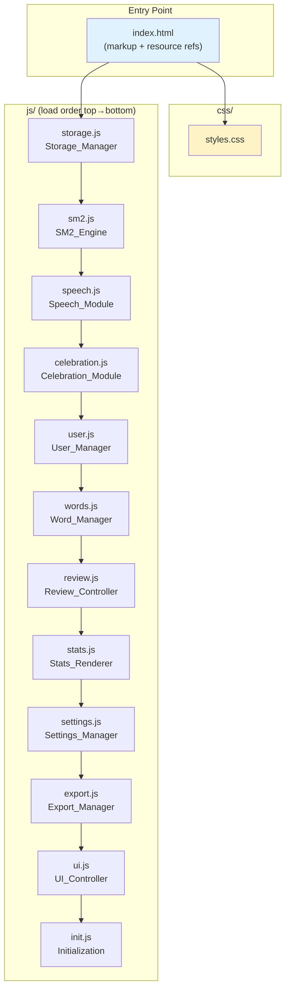

# Design Document: Modular Codebase

## Overview

This design describes the modularization of the Word Memorizer PWA from a single monolithic `index.html` (~795 lines) into a clean file structure with separated CSS and JavaScript modules. The refactor introduces no build tools — the app remains a static, no-build PWA served directly from files.

The key constraint is behavioral equivalence: every user-facing feature, localStorage interaction, PWA capability, and keyboard shortcut must work identically after modularization. The approach uses plain `<script>` tags (not ES modules) to maintain compatibility with the existing `onclick` handler pattern and avoid CORS issues when served from `file://`.

### Design Decisions

1. **Plain scripts over ES modules**: The app uses inline `onclick` handlers extensively. ES modules scope their exports and don't pollute the global namespace by default, which would break every `onclick="someFunction()"` in the HTML. Using plain `<script>` tags with functions attached to `window` is the simplest path that preserves all existing behavior.

2. **No build tools**: The requirements explicitly prohibit bundlers. All files are loaded via `<script>` and `<link>` tags directly.

3. **Dependency order via script tag ordering**: Since modules are plain scripts sharing the global scope, load order in `index.html` determines dependency resolution. Foundation modules (storage, utilities) load first, feature modules next, UI/init last.

4. **Minimal HTML changes**: `index.html` retains all markup, element IDs, class names, and inline `style` attributes. Only `<style>` and `<script>` blocks are removed and replaced with external file references.

## Architecture



### Dependency Graph

```
storage.js       ← foundation: localStorage helpers, shared state (words, currentUser)
  ↓
sm2.js           ← pure algorithm: SM-2 interval/easeFactor computation
  ↓
speech.js        ← standalone: Web Speech API wrapper
celebration.js   ← standalone: rain animation effect
  ↓
user.js          ← depends on: storage
  ↓
words.js         ← depends on: storage, sm2
  ↓
review.js        ← depends on: storage, sm2, speech, celebration, words
  ↓
stats.js         ← depends on: storage
settings.js      ← depends on: storage
export.js        ← depends on: storage
  ↓
ui.js            ← depends on: all above (view switching, rendering dispatch)
  ↓
init.js          ← depends on: storage, user (legacy migration, initial render)
```

## Components and Interfaces

### 1. Storage_Manager (`js/storage.js`)

Centralizes all localStorage access and shared mutable state.

```javascript
// Shared state (global)
window.currentUser = null;
window.words = [];
window.session = [];
window.sessionIdx = 0;
window.flipped = false;
window.correctAnswersInSession = 0;
window.reviewMode = 'flashcard';
window.writingAttempts = 0;
window.writingRevealed = false;

// Utility functions
window.today = () => new Date().setHours(0, 0, 0, 0);
window.daysFromNow = (d) => today() + d * 86400000;
window.storageKey = () => 'wm_words_' + currentUser;

// localStorage helpers
window.getUsers = () => JSON.parse(localStorage.getItem('wm_users') || '[]');
window.saveUsers = (u) => localStorage.setItem('wm_users', JSON.stringify(u));
window.save = () => localStorage.setItem(storageKey(), JSON.stringify(words));

// Legacy migration
window.migrateLegacy = () => { /* moves wm_words → wm_words_default */ };
```

### 2. SM2_Engine (`js/sm2.js`)

Pure SM-2 algorithm logic extracted from `markCard` and `applyWritingSM2`.

```javascript
// Computes new SM-2 values given current state and outcome
window.computeSM2 = (interval, easeFactor, known, fullCredit) => {
  // Returns { interval, easeFactor, nextReview, known }
};

// Applied during flashcard review
window.applyFlashcardSM2 = (wordStr, known) => { /* mutates word in words[] */ };

// Applied during writing review
window.applyWritingSM2 = (wordStr, known, fullCredit) => { /* mutates word in words[] */ };
```

### 3. Speech_Module (`js/speech.js`)

```javascript
window.speakWord = (word) => { /* SpeechSynthesisUtterance with lang='en-US' */ };
window.speakBtn = (word) => { /* returns HTML string for 🔊 button */ };
```

### 4. Celebration_Module (`js/celebration.js`)

```javascript
window.showGoodJob = () => { /* creates rain animation elements */ };
```

### 5. User_Manager (`js/user.js`)

```javascript
window.renderUserList = () => { /* renders user selection screen */ };
window.createUser = () => { /* creates new user from input */ };
window.deleteUser = (name) => { /* deletes user and their data */ };
window.selectUser = (name) => { /* loads user data, shows main app */ };
window.switchUser = () => { /* returns to user selection screen */ };
```

### 6. Word_Manager (`js/words.js`)

```javascript
window.addWord = () => { /* adds single word from form */ };
window.bulkAdd = async () => { /* bulk add with API lookups */ };
window.fetchDefinition = async (w) => { /* MW or free dictionary API */ };
window.importFile = (e) => { /* imports words from .txt file */ };
window.renderNotFound = (list) => { /* renders not-found word UI */ };
window.addManually = (w) => { /* pre-fills add form for manual entry */ };
window.ignoreNotFound = (w) => { /* removes word from not-found list */ };
window.deleteWord = (i) => { /* deletes word by index */ };
```

### 7. Review_Controller (`js/review.js`)

```javascript
window.setReviewMode = (mode) => { /* switches flashcard/writing mode */ };
window.startSession = (all) => { /* initializes review session */ };
window.showCard = () => { /* renders current card */ };
window.flipCard = () => { /* flips flashcard to show definition */ };
window.markCard = (known) => { /* marks flashcard and advances */ };
window.renderWritingCard = (w, feedback, color) => { /* renders writing mode card */ };
window.renderWritingReveal = (w, correct) => { /* reveals answer in writing mode */ };
window.submitWriting = () => { /* handles writing mode submission */ };
window.advanceWriting = () => { /* advances to next writing card */ };
window.buildHint = (word, lettersRevealed) => { /* builds progressive hint string */ };

// Keyboard listener registered at load time
```

### 8. Stats_Renderer (`js/stats.js`)

```javascript
window.renderStats = () => { /* computes and renders all statistics */ };
window.resetProgress = () => { /* resets SM-2 data, keeps words */ };
window.deleteAllWords = () => { /* deletes all words */ };
```

### 9. Settings_Manager (`js/settings.js`)

```javascript
window.getMWKey = () => localStorage.getItem('mw_api_key') || '';
window.saveMWKey = () => { /* saves API key from input */ };
```

### 10. Export_Manager (`js/export.js`)

```javascript
window.downloadWords = () => { /* downloads words as JSON */ };
window.restoreWords = (e) => { /* restores words from JSON file */ };
```

### 11. UI_Controller (`js/ui.js`)

```javascript
window.showView = (name) => { /* switches active view, triggers renders */ };
window.renderList = () => { /* renders word list view */ };
```

### 12. Initialization (`js/init.js`)

```javascript
// Executes immediately on load:
// 1. Run migrateLegacy()
// 2. Run renderUserList()
```

## Data Models

No data model changes. The existing localStorage schema is preserved exactly:

```javascript
// User list
localStorage['wm_users'] = JSON.stringify(['alice', 'bob']);

// Per-user word list
localStorage['wm_words_alice'] = JSON.stringify([
  {
    word: 'ephemeral',
    def: 'lasting for a very short time',
    known: false,          // true when interval >= 21
    interval: 0,           // SM-2 interval in days
    easeFactor: 2.5,       // SM-2 ease factor (min 1.3)
    nextReview: 1719792000000  // timestamp (ms) of next review date
  }
]);

// API key
localStorage['mw_api_key'] = 'some-key-string';

// Legacy key (migrated on first load)
localStorage['wm_words'] = '...';  // moved to wm_words_default
```


## Correctness Properties

*A property is a characteristic or behavior that should hold true across all valid executions of a system — essentially, a formal statement about what the system should do. Properties serve as the bridge between human-readable specifications and machine-verifiable correctness guarantees.*

### Property 1: SM-2 computation correctness

*For any* valid SM-2 state (interval ≥ 0, easeFactor ≥ 1.3) and any review outcome (known=true/false, fullCredit=true/false), the `computeSM2` function SHALL produce:
- When known=true: interval progresses as 0→1→2→round(interval×easeFactor), and easeFactor increases by 0.1 if fullCredit, unchanged otherwise, with minimum 1.3
- When known=false: interval resets to 1, easeFactor decreases by 0.2 with minimum 1.3
- nextReview is always today + (new interval) days
- known flag is true if and only if interval ≥ 21

**Validates: Requirements 4.3, 4.4**

### Property 2: SM-2 default values invariant

*For any* word object (whether newly created, reset, or patched from legacy data), after the initialization/reset/patch operation completes, the word SHALL have: easeFactor=2.5, interval=0, nextReview=today, and known=false.

**Validates: Requirements 4.2, 4.7, 7.2**

### Property 3: Stats computation correctness

*For any* array of word objects with valid SM-2 fields, the stats computation SHALL produce: total = array length, due = count where nextReview ≤ today, mature = count where interval ≥ 21, mastery = round(mature/total × 100) (or 0 if total is 0).

**Validates: Requirements 4.5**

### Property 4: Export/import round-trip

*For any* valid word array, serializing it with `JSON.stringify(words, null, 2)` and then parsing it back with `JSON.parse` SHALL produce an array deeply equal to the original.

**Validates: Requirements 4.6**

### Property 5: User storage round-trip

*For any* list of unique non-empty usernames, saving them via `saveUsers` and reading them back via `getUsers` SHALL return the same list.

**Validates: Requirements 4.1**

## Error Handling

Since this is a refactoring with no new features, error handling preserves the existing behavior:

| Scenario | Current Behavior | Modularized Behavior |
|---|---|---|
| Empty word input | Shows "Please enter a word" message | Identical — `addWord()` in `words.js` |
| Duplicate word | Shows "Word already exists" message | Identical — same check in `addWord()` |
| API fetch failure | Word added to "not found" list | Identical — `bulkAdd()` catch block |
| Invalid restore file | Shows "Invalid file" message | Identical — `restoreWords()` catch block |
| Missing SM-2 fields on load | Patched with defaults | Identical — `selectUser()` forEach patch |
| Script load failure | Graceful degradation — functions from later scripts may be undefined but earlier modules still work | Same behavior; no try/catch wrapping added since the current version has none |

## Testing Strategy

### Approach

The existing Puppeteer-based test suite (`run_tests.mjs` + `tests/*.html`) provides integration-level coverage for PWA meta tags, bulk add, export/import, user switching, and MW API key handling. These tests continue to work unchanged after modularization.

New tests are added at two levels:

1. **Smoke tests** (structural verification): Verify the file structure, script loading, and HTML integrity after modularization
2. **Property-based tests**: Verify the extracted pure-logic modules (SM-2 engine, stats computation, storage round-trips) produce correct results across a wide range of inputs

### Property-Based Testing

Library: [fast-check](https://github.com/dubzzz/fast-check) (JavaScript PBT library, works in Node.js)

Each correctness property maps to a single property-based test with minimum 100 iterations:

| Property | Test File | What It Generates |
|---|---|---|
| Property 1: SM-2 computation | `tests/pbt/sm2.test.mjs` | Random (interval, easeFactor, known, fullCredit) tuples |
| Property 2: SM-2 defaults | `tests/pbt/sm2.test.mjs` | Random word objects with missing/present SM-2 fields |
| Property 3: Stats computation | `tests/pbt/stats.test.mjs` | Random arrays of word objects with varying SM-2 states |
| Property 4: Export round-trip | `tests/pbt/export.test.mjs` | Random word arrays with various string content |
| Property 5: User storage round-trip | `tests/pbt/storage.test.mjs` | Random lists of unique username strings |

Tag format: `Feature: modular-codebase, Property {N}: {title}`

### Unit Tests (Example-Based)

Existing Puppeteer tests cover integration scenarios. Additional example-based tests verify:

- All `onclick`-referenced functions exist on `window` after scripts load
- Keyboard shortcuts dispatch correctly in flashcard mode and are ignored in writing mode
- Legacy migration moves `wm_words` to `wm_words_default`
- Speech module calls `SpeechSynthesisUtterance` with `lang='en-US'`
- MW API key selection logic (MW key present → MW API, absent → free API)

### Smoke Tests

Structural checks run as part of the existing Puppeteer suite:

- `index.html` contains no `<style>` or `<script>` blocks (only external refs)
- All expected `.js` files exist in `js/`
- `css/styles.css` exists and contains key selectors
- Script tags appear in correct dependency order
- All PWA meta tags preserved (existing `test_pwa.html` covers this)
- No 404 errors when serving the app
